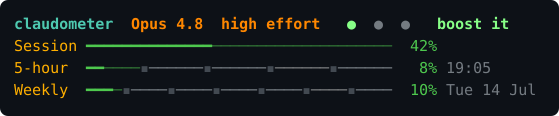
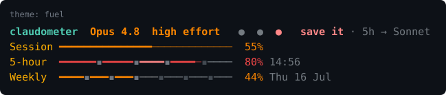
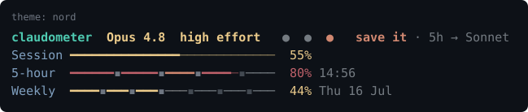
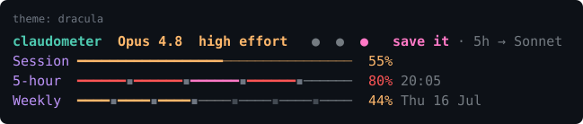
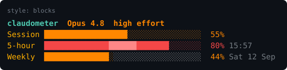
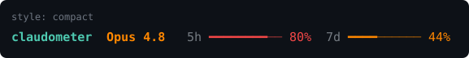
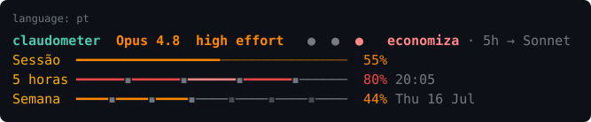

# claudometer

**A time-paced rate-limit statusline for Claude Code** — bars that double as a clock.



Most usage statuslines show you a number. claudometer shows it **against the clock**: the 5-hour
and 7-day bars are split into time segments, so you can see at a glance whether you're *ahead of
pace*, *on pace*, or *burning too fast*.

## Bars that are also a clock

Claude Code's rate limits roll over every **5 hours** and every **7 days**. claudometer splits each
bar into segments that map onto that window — 5 segments (one per hour), 7 segments (one per day) —
highlights the segment for *right now*, and colors the fill by **pace**:

| Color | Meaning |
| :---- | :------ |
| 🟢 green | **ahead** — using less than your time-share of the window. Room to spare. |
| 🟠 orange | **on pace** — spending about the quota budgeted for where you are. |
| 🔴 red | **behind** — burned past your time-share; you may hit the wall before it resets. |

So a bar that's 60% full isn't automatically bad: 4 days into the weekly window, 60% is *ahead*
(green); one hour into the 5-hour window, the same 60% is *behind* (red).

## Themes

Three palettes — `fuel` (default; 256-color, works everywhere), plus the official **Nord** and
**Dracula** in truecolor. Switch anytime with `/claudometer:theme` or an env var.





## Styles

`segmented` (default), `blocks` (a solid gauge — same clock, no dividers), and `compact` (one line,
keeping a mini paced bar):




## Languages

English and Portuguese:



## Install

**Requirements:** [`jq`](https://jqlang.github.io/jq/), Claude Code **2.1+**, and a **Pro or Max**
plan (the 5h/7d bars need the `rate_limits` data Claude Code sends to subscribers; the context bar
works on any plan). Truecolor themes need a truecolor terminal.

### Option 1 — Manual (recommended)

```bash
git clone https://github.com/lucas-lima-duarte/claudometer.git
chmod +x claudometer/scripts/statusline.sh
```

Add this to your `~/.claude/settings.json` (merge with whatever is already there):

```json
{
  "statusLine": {
    "type": "command",
    "command": "/absolute/path/to/claudometer/scripts/statusline.sh"
  }
}
```

### Option 2 — As a plugin

```
/plugin marketplace add lucas-lima-duarte/claudometer
/plugin install claudometer@claudometer
/claudometer:setup
```

`/claudometer:setup` writes the `statusLine` block for you, and `/claudometer:theme <theme> [style]
[lang]` switches everything afterwards — no editing `settings.json` by hand. (To try it without
installing: `claude --plugin-dir /path/to/claudometer`.)

## Configuration

Two ways — pick either:

- **Easiest — the plugin command:** `/claudometer:theme <theme> [style] [lang]`, e.g.
  `/claudometer:theme dracula compact`. Run it with no arguments to see the options.
- **By hand:** set env vars inline in your `statusLine` command (or export them in your shell).

All optional; with none you get `fuel` + `segmented` + `en`.

| Variable | Values | Default | What it does |
| :------- | :----- | :------ | :----------- |
| `CLAUDOMETER_THEME` | `fuel` · `nord` · `dracula` | `fuel` | color palette |
| `CLAUDOMETER_STYLE` | `segmented` · `blocks` · `compact` | `segmented` | bar layout |
| `CLAUDOMETER_LANG`  | `en` · `pt` | `$LANG` prefix, else `en` | language |

Example — Dracula palette, compact layout, in Portuguese:

```json
{
  "statusLine": {
    "type": "command",
    "command": "CLAUDOMETER_THEME=dracula CLAUDOMETER_STYLE=compact CLAUDOMETER_LANG=pt /path/to/claudometer/scripts/statusline.sh"
  }
}
```

Run `scripts/demo.sh` to preview every state, theme, style and language at once.

## Privacy

claudometer is just a local shell script. It makes **zero network/API calls** and uses **zero
tokens** — Claude Code pipes the session JSON to it on stdin and renders whatever it prints.

## Roadmap

- **More palettes** — Gruvbox / Solarized / Tokyo Night / Catppuccin.
- **Multi-profile indicator** — show which `CLAUDE_CONFIG_DIR` profile is active, generically.
- **Punchier copy** — more characterful wording for the labels.

## Contributing

`main` is protected — all changes go through pull requests, including the maintainer's. See
[CONTRIBUTING.md](./CONTRIBUTING.md) for the workflow. The README images are generated from the
statusline itself via `scripts/gen-readme-images.sh`.

## License

[MIT](./LICENSE)
